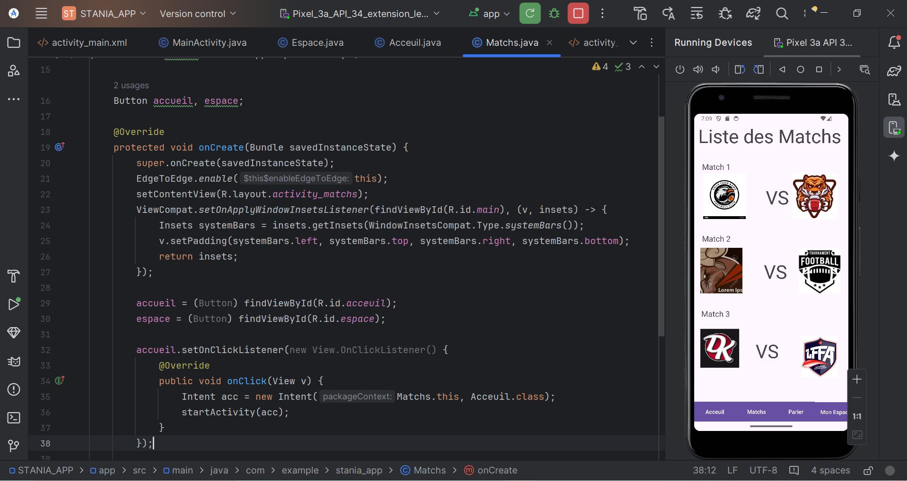
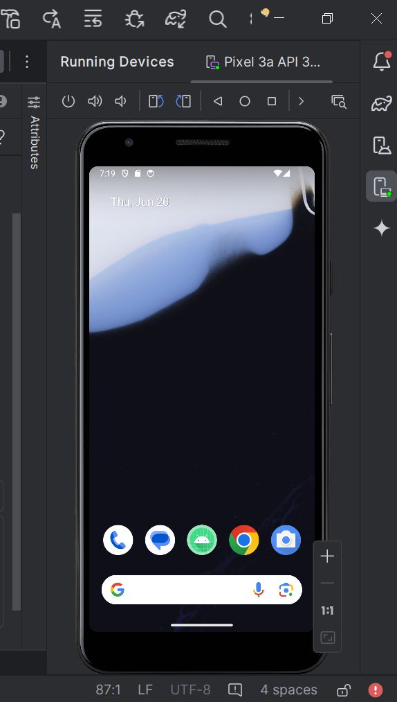
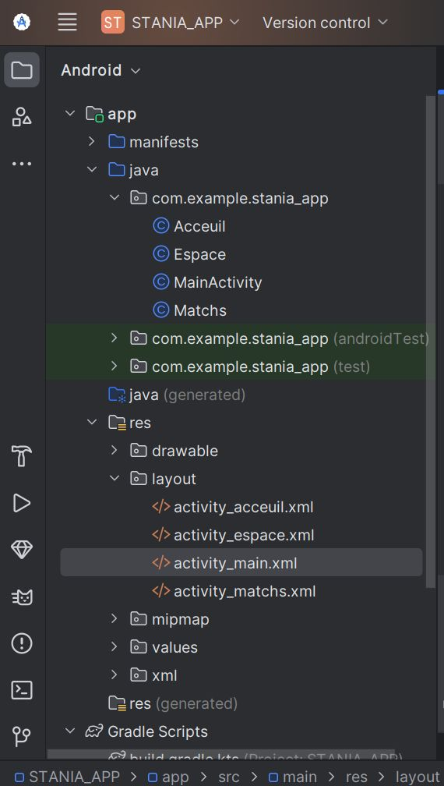
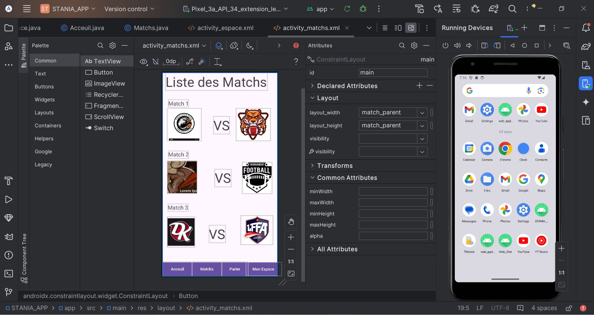
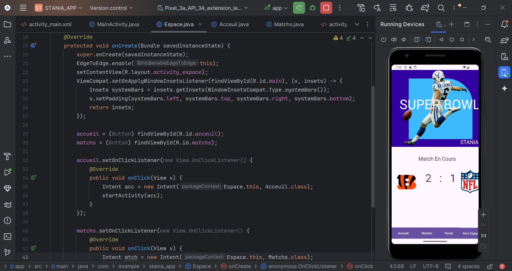
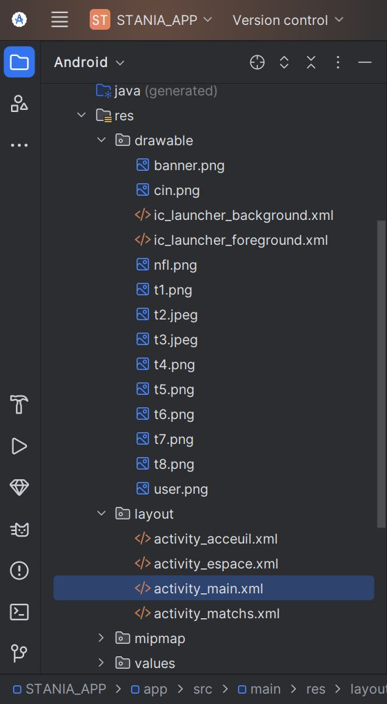
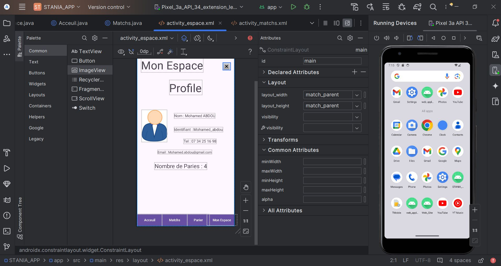

# STANIA Mobile App

Une application Android du Bet Sportif

## Prérequis

Avant de commencer, assurez-vous d'avoir les éléments suivants installés sur votre machine :

- **Android Studio** : Téléchargez la dernière version d'Android Studio à partir de [ici](https://developer.android.com/studio).
- **Java Development Kit (JDK)** : Assurez-vous d'avoir le JDK 8 ou une version supérieure. Vous pouvez le télécharger depuis [Oracle](https://www.oracle.com/java/technologies/javase-jdk11-downloads.html).
- **Un appareil Android ou un émulateur** : Un appareil physique avec "Debugging USB" activé, ou un émulateur configuré dans Android Studio.

## Installation

Suivez les étapes ci-dessous pour installer et configurer le projet sur votre machine locale.

1. **Cloner le dépôt**

   Clonez le dépôt GitHub sur votre machine locale en utilisant la commande suivante dans votre terminal :

   ```bash
   git clone https://github.com/nom_utilisateur/STANIA Mobile App.git

 
2. **Ouvrir le projet dans Android Studio**

   - Ouvrez Android Studio.
   - Sélectionnez "Open an existing project".
   - Naviguez vers le dossier où vous avez cloné le dépôt et sélectionnez-le.
   - Android Studio importera automatiquement le projet et téléchargera les dépendances nécessaires.

3. **Configurer l'émulateur ou connecter un appareil**

   - **Émulateur** : Allez dans `Tools > AVD Manager`, puis créez un nouvel appareil virtuel en choisissant un modèle d'appareil et une image système (de préférence avec Google Play Services).
   - **Appareil physique** : Connectez votre appareil via USB et assurez-vous que le mode "Debugging USB" est activé dans les paramètres développeur.

## Lancer l'application

1. **Construire le projet**

   - Assurez-vous que le projet est correctement configuré en allant dans `Build > Clean Project` puis `Build > Rebuild Project`.

2. **Exécuter l'application**

   - Cliquez sur le bouton vert "Run" en haut de l'interface Android Studio, ou utilisez le raccourci `Shift + F10`.
   - Sélectionnez l'appareil ou l'émulateur sur lequel vous souhaitez exécuter l'application.
   - Android Studio va compiler le code, construire l'APK, et lancer l'application sur l'appareil sélectionné.

3. **Vérifier les logs**

   - Utilisez la fenêtre `Logcat` dans Android Studio pour voir les logs de l'application en temps réel. Cela peut vous aider à diagnostiquer et résoudre les problèmes éventuels.
  
   # II - Execution de l'application STANIA Mobile APP

   
   <br>
    
    <br>
     
     <br>
      
      <br>
       
       <br>
        
        <br>
         
